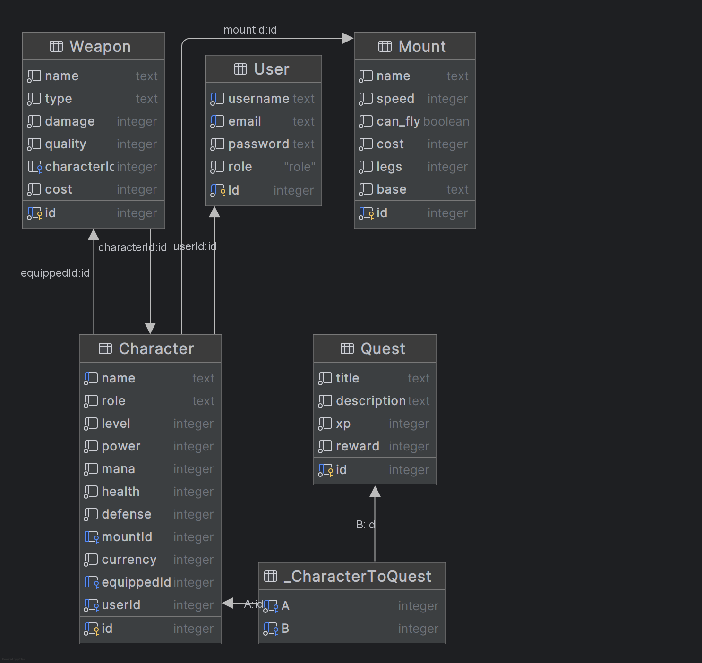
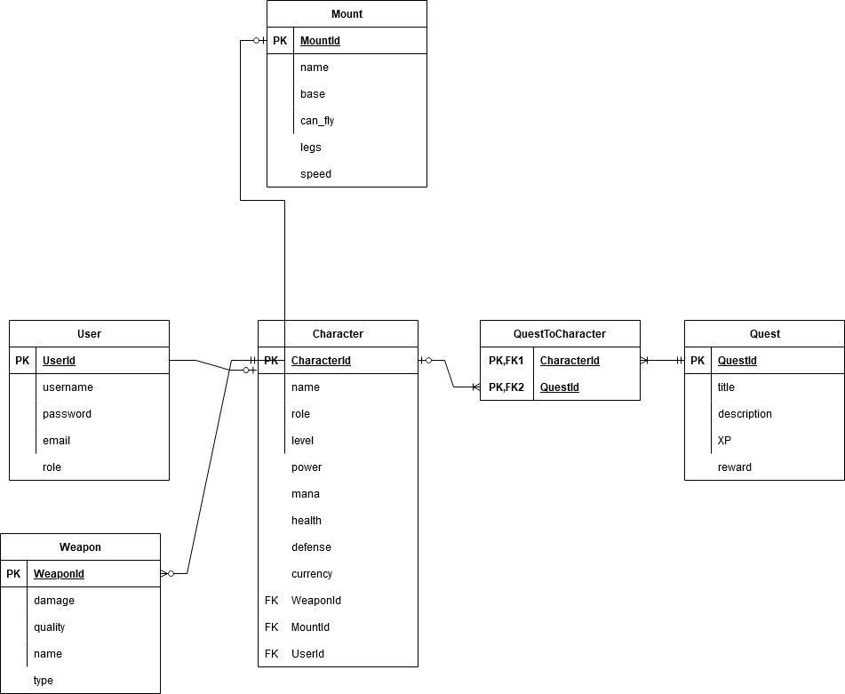
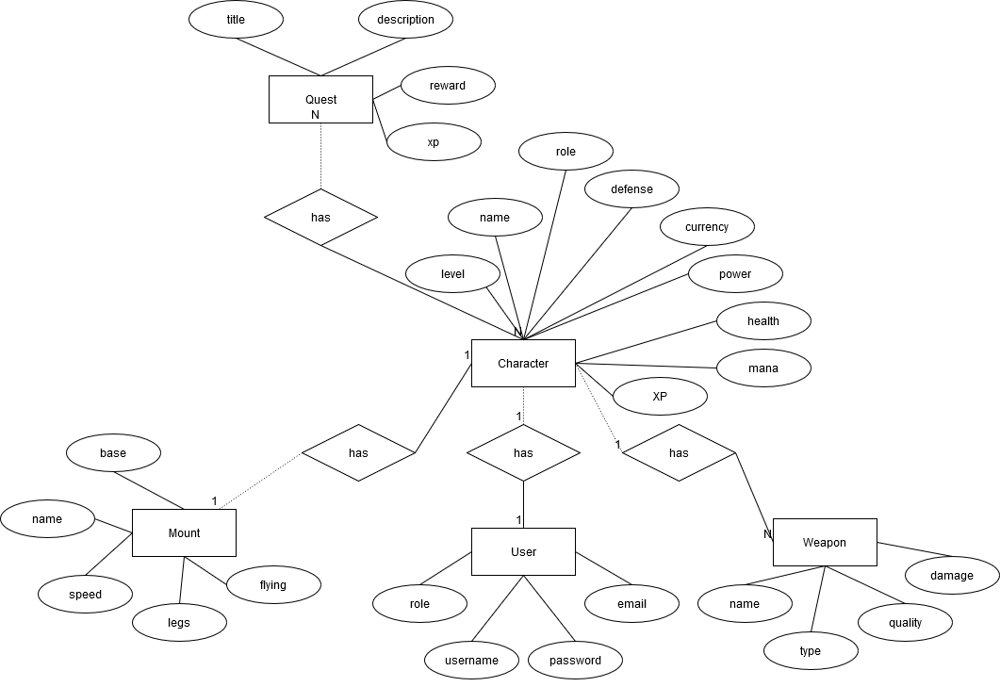

# Project analysis

## Introduction: RPGWEB
RPGWEB offers a different approach to playing games. Now you can simulate the gaming process in your web browser! Users can create a character, create a mount and craft weapons! Completing quests offers you experience and currency to level up your character. 

---

### Create a New Character
As a user,  
I want to create a new character with a unique name and role,  
So that I can start playing the game.

**Acceptance Criteria:**
- Given valid input data (user ID, name, and role), when I create a character, then the system creates and returns the new character.
- Given an existing character for the user ID, when I attempt to create a character, then the system returns an error: `"A character already exists for this user."`

---

### Delete a Character
As a user,  
I want to delete an existing character by its unique ID,  
So that I can remove characters I no longer want or need.

**Acceptance Criteria:**
- Given a valid character ID, when I delete a character, then the system removes the character and returns the deleted character data.
- Given an invalid character ID, when I attempt to delete a character, then the system returns an error: `"Character with id does not exist or could not be deleted."`

---

### Update Character Details
As a user,  
I want to update my character's details, such as level, stats, or associated items,  
So that I can customize and improve my character over time.

**Acceptance Criteria:**
- Given a valid character ID and update data, when I update my character, then the system updates and returns the modified character.
- Given an invalid character ID, when I attempt to update a character, then the system returns an error: `"Character with id does not exist or could not be updated."`

---

### Accept a Quest
As a user,  
I want my character to accept a quest by providing the quest ID,  
So that I can engage in adventures and gain rewards.

**Acceptance Criteria:**
- Given a valid character ID and quest ID, when I accept a quest, then the quest is added to the character's list of quests.
- Given a quest already accepted by the character, when I attempt to accept the same quest, then the system returns an error: `"This quest has already been accepted by this character!"`

---

### Switch Weapons
As a user,  
I want my character to switch their currently equipped weapon to another one in their inventory,  
So that I can adapt to different challenges and situations in the game.

**Acceptance Criteria:**
- Given a valid character ID and weapon ID, when I switch a weapon, then the new weapon is equipped, and the system updates the character's inventory.
- Given an invalid character ID or weapon ID, when I attempt to switch a weapon, then the system returns an error: `"Character with id or weapon id does not exist or could not be updated."`

---

### Create a Mount
As a player,  
I want to create a new mount for my character,  
So that I can enhance my character's abilities.

**Acceptance Criteria:**
- Given a valid character ID and mount details (`name`, `base`, `legs`, `can_fly`), when I create a mount, then the system creates and associates the mount with my character.
- The mount should have a randomly generated speed between 1 and 100.
- Given a mount name with fewer than 3 characters, when I create a mount, then the system returns an error: `"Your mount name must have at least 3 characters."`
- Given no character ID, when I attempt to create a mount, then the system returns an error: `"You must have a character to create a mount!"`
- Given an existing mount for the character, when I attempt to create another mount, then the system returns an error: `"A mount already exists for this character!"`

---

### Delete a Mount
As a player,  
I want to delete a mount from the system,  
So that I can remove unwanted mounts.

**Acceptance Criteria:**
- Given a valid mount ID, when I delete a mount, then the system removes the mount and returns the deleted mount data.
- Given an invalid mount ID, when I attempt to delete a mount, then the system returns an error: `"Mount with id <ID> does not exist or could not be deleted."`

---

### Update a Mount
As a player,  
I want to update the details of an existing mount,  
So that I can modify its attributes.

**Acceptance Criteria:**
- Given a valid mount ID and updated details (`name`, `speed`, `base`, `legs`), when I update a mount, then the system updates and returns the modified mount.
- Given a mount name with fewer than 3 characters, when I update a mount, then the system returns an error: `"Your mount name must have at least 3 characters."`
- Given an invalid mount ID, when I attempt to update a mount, then the system returns an error: `"Mount with id <ID> does not exist or could not be updated."`

---

### Create a Weapon
As a user,  
I want to create a new weapon with specific attributes,  
So that my character can use it in the game.

**Acceptance Criteria:**
- Given a valid character ID and weapon details (`name`, `type`), when I create a weapon, then the system generates a new weapon with randomized `damage` (1-60) and `quality` (1-100) and associates it with my character.
- Given no character ID, when I attempt to create a weapon, then the system returns an error: `"You must have a character to craft a weapon!"`
- Given missing or invalid weapon details (`name`, `type`), when I attempt to create a weapon, then the system returns an error: `"Invalid data: name and type are required for weapon creation."`
- Given a failure in the weapon creation process, when I attempt to create a weapon, then the system returns an error: `"Failed to create weapon with name: <name>."`

---

### Delete a Weapon
As a user,  
I want to delete a weapon by its unique ID,  
So that I can remove unwanted or unused weapons from the system.

**Acceptance Criteria:**
- Given a valid weapon ID, when I delete a weapon, then the system removes the weapon and returns its details.
- Given an invalid weapon ID, when I attempt to delete a weapon, then the system returns an error: `"Weapon with id <ID> does not exist or could not be deleted."`

---

### Update a Weapon
As a user,  
I want to update the details of an existing weapon,  
So that I can modify its attributes as needed.

**Acceptance Criteria:**
- Given a valid weapon ID and updated details (`name`, `type`, `damage`, `quality`), when I update a weapon, then the system updates the weapon and returns its new details.
- Given missing or invalid updated details (`name`, `type`, `damage`, `quality`), when I attempt to update a weapon, then the system returns an error: `"Invalid data: all fields (name, type, damage, and quality) are required for weapon update."`
- Given an invalid weapon ID, when I attempt to update a weapon, then the system returns an error: `"Weapon with id <ID> does not exist or could not be updated."`
- Given a failure in the update process, when I attempt to update a weapon, then the system returns an error: `"Failed to update weapon."`

---

### Create a Quest
As a user,  
I want to create a new quest with specific attributes,  
So that I can add new challenges for characters to complete.

**Acceptance Criteria:**
- Given valid quest details (`title`, `description`, `xp`, `reward`), when I create a quest, then the system generates a new quest and returns its details.
- Given missing or invalid quest details (`title`, `description`, `xp`), when I attempt to create a quest, then the system returns an error: `"Failed to create quest."`

---

### Delete a Quest
As a user,  
I want to delete a quest by its unique ID,  
So that I can remove unwanted or obsolete quests from the system.

**Acceptance Criteria:**
- Given a valid quest ID, when I delete a quest, then the system removes the quest and returns its details.
- Given an invalid quest ID, when I attempt to delete a quest, then the system returns an error: `"Failed to delete quest."`

---

### Update a Quest
As a user,  
I want to update the details of an existing quest,  
So that I can modify its attributes as needed.

**Acceptance Criteria:**
- Given a valid quest ID and updated details (`title`, `description`, `xp`, `reward`), when I update a quest, then the system updates the quest and returns its new details.
- Given missing or invalid updated details (`title`, `description`, `xp`), when I attempt to update a quest, then the system returns an error: `"Invalid data: title, description, and xp are required."`
- Given an invalid quest ID, when I attempt to update a quest, then the system returns an error: `"Failed to update quest."`

---

### Create a User
As a user,  
I want to create a new user with specific attributes,  
So that I can add them to the system for authentication and role management.

**Acceptance Criteria:**
- Given valid user details (`username`, `password`, `email`, `role`), when I create a user, then the system stores the user in the database and returns the user’s details.
- Given missing or invalid user details (`username`, `password`, `email`, `role`), when I attempt to create a user, then the system returns an error: `"Invalid data: username, password, email, and role are required for user creation."`

---

### Authenticate a User
As a user,  
I want to authenticate using my username and password,  
So that I can access my account securely.

**Acceptance Criteria:**
- Given valid credentials (`username` and `password`), when I authenticate, then the system generates a JWT token and returns it along with user details.
- Given an invalid username, when I attempt to authenticate, then the system returns an error: `"Character with username ${username} does not exist or could not be fetched."`
- Given an incorrect password, when I attempt to authenticate, then the system returns an error: `"Incorrect password."`

--- 

Let me know if you need refinements or additional user stories!
Let me know if you need refinements or more user stories!
## Domain model

## Logical model 

## Conceptual model
